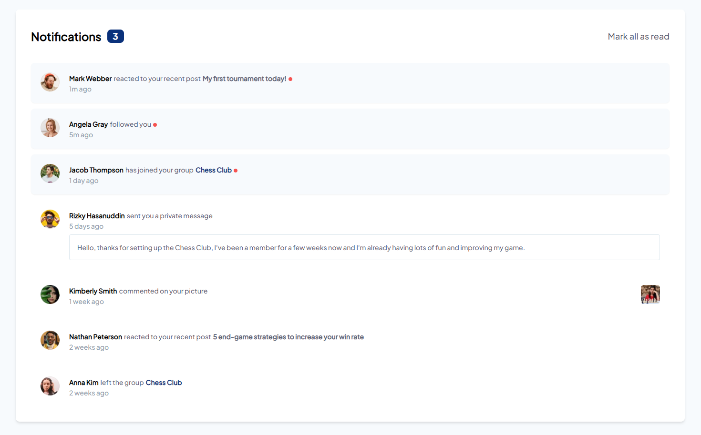

# Frontend Mentor - Notifications page solution

This is a solution to the [Notifications page challenge on Frontend Mentor](https://www.frontendmentor.io/challenges/notifications-page-DqK5QAmKbC). Frontend Mentor challenges help you improve your coding skills by building realistic projects.

## Table of contents

- [Overview](#overview)
  - [The challenge](#the-challenge)
  - [Screenshot](#screenshot)
  - [Links](#links)
- [My process](#my-process)
  - [Built with](#built-with)
  - [What I learned](#what-i-learned)
- [Author](#author)

**Note: Delete this note and update the table of contents based on what sections you keep.**

## Overview

### The challenge

Users should be able to:

- Distinguish between "unread" and "read" notifications
- Select "Mark all as read" to toggle the visual state of the unread notifications and set the number of unread messages to zero
- View the optimal layout for the interface depending on their device's screen size
- See hover and focus states for all interactive elements on the page

### Screenshot



### Links

- Solution URL: [github-repo](https://github.com/zhyph/notifications-page-main)
- Live Site URL: [live-solution](https://notifications-page-main-lovat.vercel.app/)

## My process

### Built with

- CSS custom properties
- Flexbox
- Mobile-first workflow
- [JSX from React](https://reactjs.org/)
- [SolidJS](https://www.solidjs.com/) - JS library
- [Tailwind CSS](https://tailwindcss.com/) - For styles

### What I learned

Since I don't really use TypeScript that often one thing tha caught me on the nerves was when trying to access a object property with a variable, in plain JS you can just do something like this

```js
const myVal = MAPPED_VALUES[VAR];
```

If that didn't have a value with would just return `undefined`, but with TypeScript you need to make sure that doesn't actually return `undefined`.
e.g.

```js
  // This would be used to validate if the obj has the attribute available to be acessed
  const isValidAction = (x: string, obj: object): x is keyof typeof obj =>
    x in obj;

  // And it would be used like this.
  const myVal = isValidAction(
          'val',
          MAPPED_VALUES
        )
          ? MAPPED_VALUES['val']
          : "something else";
```

It may be wrong, but, that was the only way I found to use this without TypeScript going crazy.

## Author

- Frontend Mentor - [@zhyph](https://www.frontendmentor.io/profile/zhyph)
- Linkedin - [Artur Almeida](https://www.linkedin.com/in/artur-almeida-61ab6a1b4/)
